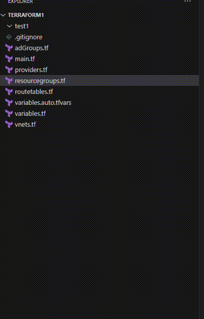

# Terraform-Docs  vsCode Extension

This is a Visual Studio Code extension that allows you to generate Terraform documentation by running the `terraform-docs` command.

## Features

- Right-click on any `.tf` or `.tfvars` file in the Explorer panel and select "Generate Terraform Docs" to generate a `README.md` file in the same directory.
- If a `README.md` file already exists, you will be asked for confirmation before it is overwritten.

## Requirements

This extension requires the `terraform-docs` command-line tool to be installed and available in your `PATH`. You can download it from https://github.com/terraform-docs/terraform-docs/releases/latest .

## Installation

To install this extension:

1. Download the `.vsix` file from the GitHub repository.
2. Open VS Code.
3. Click on the Extensions view icon on the Sidebar.
4. Click on the More (...) menu at the top of the Extensions view.
5. Select `Install from VSIX...`.
6. Choose the `.vsix` file you downloaded.

## Usage

To use this extension:

1. Right-click on any `.tf` file in the Explorer panel.
2. Select "Generate Terraform Docs".
3. If a `README.md` file already exists in the same directory, you will be asked for confirmation before it is overwritten.

## Contributing

If you have suggestions for how this extension could be improved, or want to report a bug, open an issue on the GitHub repository. We'd love to hear from you!

## License

This extension is use at own risk.

